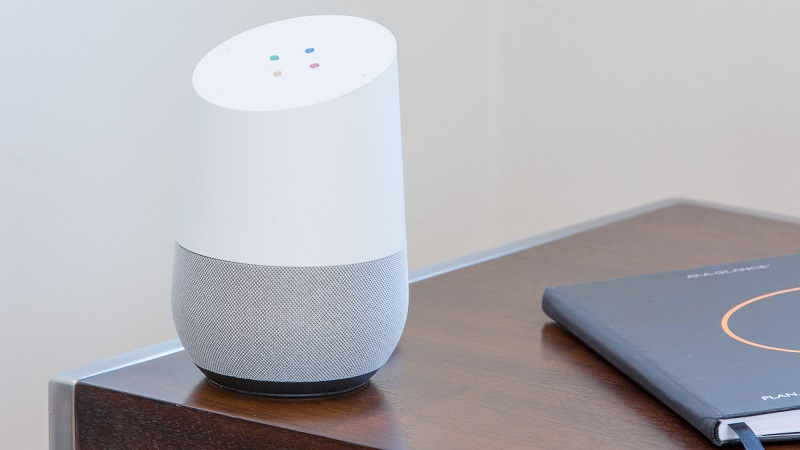
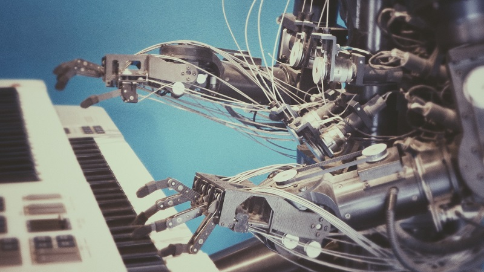
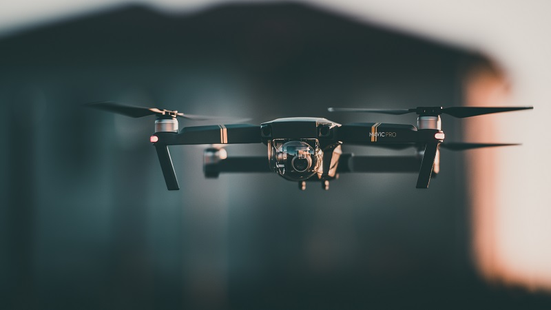

---
# set the layout to use, in this case, the homepage one
layout: layouts/homepage

# set the page title
title: Industry 4.0

# We can set extra info here to use in our templates

hero:

    title: "Industry 4.0 is a name given to the current trend of automation and data
                exchange in manufacturing technologies. It includes cyber-physical systems, the Internet
                of things, cloud computing and cognitive computing. A part of this phase of industrial change is the joining of technologies like artificial intelligence, gene editing, to advanced robotics, the internet of things (IoT). (From Wikipedia)"
---

## Artifical Intelligence (AI)

Artificial intelligence (AI) is intelligence demonstrated by machines,as opposed to the natural intelligence displayed by humans or animals.Leading AI textbooks define the field as the study of "intelligent agents":any system that perceives its environment and takes actions that maximize its chance of achieving its goals(Wikipedia).

## Internet of things(IoT)

The Internet of things (IoT) describes the network of physical objects, so known as, "things" — that are embedded with sensors, software, and other technologies that is used for the purpose of connecting and exchanging data with other devices and systems over the Internet (Wikipedia).

## Cognitive Computing

Cognitive computing (CC) refers to technology platforms that,broadly speaking,are based on the scientific disciplines of artificial intelligence and signal processing.Machine learning, reasoning,natural language processing,speech recognition and vision,
human–computer interaction,dialog and narrative generation, among other technologies (Wikipedia).

## Cloud Computing

Cloud computing is the on-demand availability of computer system resources, especially
data storage (cloud storage) and computing power, without direct active management by the user. Large clouds often have functions distributed over multiple locations, each location being a data center(Wikipedia).

## Robotics

Robotics is an interdisciplinary field that integrates computer science and engineering. Robotics involves design, construction, operation, and use of robots. The goal of robotics is to design machines that can help and assist humans(Wikipedia).

## Blockchain

A blockchain is a growing list of records, called blocks, that are linked together
using cryptography. Each block contains a cryptographic hash of the previous block,
a timestamp, and transaction data (generally represented as a Merkle tree)(Wikipedia). 
